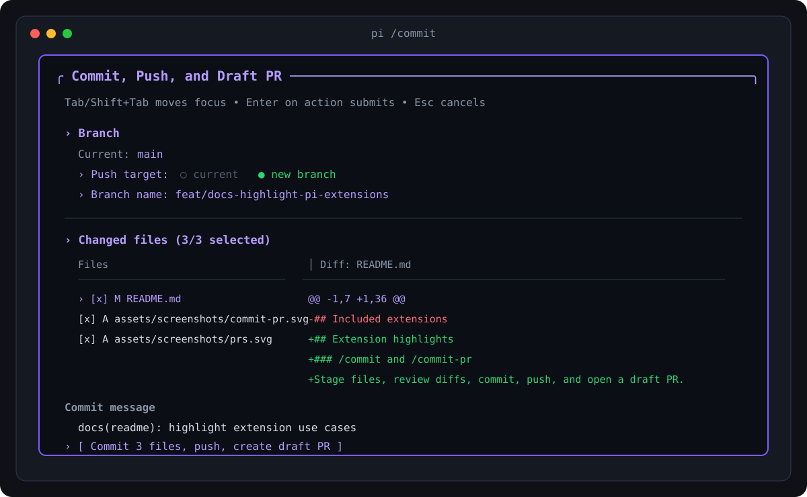
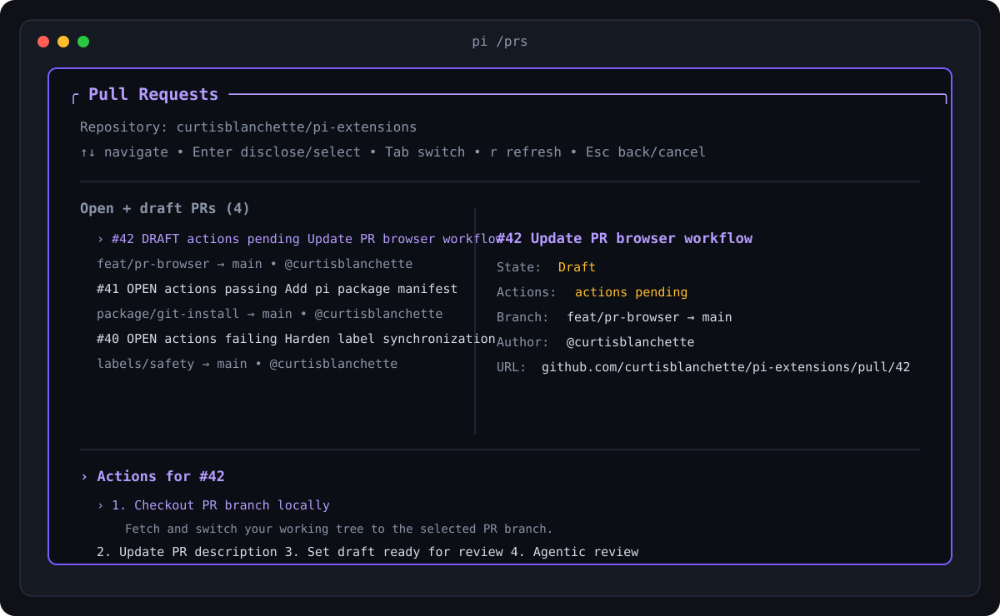
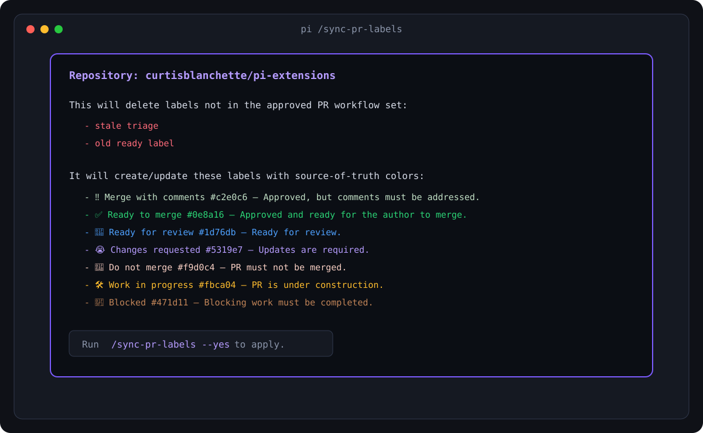

<p align="center">
  <a href="https://pi.dev">
    <picture>
      <source media="(prefers-color-scheme: dark)" srcset="https://pi.dev/logo.svg">
      <source media="(prefers-color-scheme: light)" srcset="https://huggingface.co/buckets/julien-c/my-training-bucket/resolve/pi-logo-dark.svg">
      
    </picture>
  </a>
</p>

<h1 align="center">pi-extensions</h1>

Curtis Blanchette's personal [pi](https://github.com/earendil-works/pi) extensions, packaged so users can install them directly from GitHub without cloning this repository into their own pi setup.

```bash
pi install git:github.com/curtisblanchette/pi-extensions
```

> Screenshots below are illustrative terminal captures of the current extension UIs.

## Requirements

- `pi` installed and configured.
- `git` available in the repositories where commands run.
- GitHub CLI (`gh`) installed and authenticated for GitHub-backed workflows:
  ```bash
  gh auth login
  ```
- A configured pi model/API key for AI-assisted `/prs` actions such as PR description generation and review comments.

## Extensions at a glance

| Extension | Commands | Best for |
| --- | --- | --- |
| [`commit-pr.ts`](./extensions/commit-pr.ts) | `/commit`, `/commit-pr` | Stage files, write a Conventional Commit, push a branch, and open a draft PR from one TUI. |
| [`prs.ts`](./extensions/prs.ts) | `/prs` | Browse open PRs, inspect CI state, checkout branches, update descriptions, run review workflows, and explain failures. |
| [`sync-pr-labels.ts`](./extensions/sync-pr-labels.ts) | `/sync-pr-labels` | Normalize a repository's PR workflow labels to the approved label set. |

## Install

Install globally for all pi sessions:

```bash
pi install git:github.com/curtisblanchette/pi-extensions
```

Try it for one run without saving it to settings:

```bash
pi -e git:github.com/curtisblanchette/pi-extensions
```

Update after installing:

```bash
pi update git:github.com/curtisblanchette/pi-extensions
```

Remove later if needed:

```bash
pi remove git:github.com/curtisblanchette/pi-extensions
```

## Extension highlights

### `/commit` and `/commit-pr` — Commit, push, and draft PR wizard



An interactive git workflow for turning local changes into a pushed branch and draft pull request.

**What it does**

- Detects changed, staged, unstaged, renamed, and untracked files.
- Lets you select exactly which files should be committed.
- Shows an inline per-file diff while selecting files.
- Suggests a Conventional Commit message from changed paths/diffs.
- Lets you push to the current branch or create a new branch.
- Runs `git add`/`restore --staged`, `git commit`, `git push -u`, and `gh pr create --draft`.
- Builds a PR body from the repository PR template when one exists.
- Opens the PR in the browser and applies the `🛠️ Work in progress` label to draft PRs when possible.

**Use cases**

- You have a mixed working tree and want to safely commit only the intended files.
- You are on `main`, `master`, `develop`, or `trunk` and want a guided new-branch flow.
- You want consistent Conventional Commits without manually crafting the first draft.
- You want to reduce context switching between pi, git, and GitHub when creating PRs.

**Run**

```text
/commit
# or
/commit-pr
```

---

### `/prs` — Pull request command center



A terminal PR browser and action launcher inside pi.

**What it does**

- Lists open and draft PRs for the active GitHub repository.
- Shows PR branch, author, updated time, URL, and CI/check status.
- Keeps workflow labels fresh based on draft/review state where possible.
- Checks out a selected PR branch locally.
- Generates and lets you edit an AI-written PR description before updating GitHub.
- Marks draft PRs ready for review.
- Runs agentic review flows that propose inline comments, ask for approval, and post selected comments.
- Explains failing GitHub Actions/check runs using the active pi model, with a fallback summary when model auth is unavailable.

**Use cases**

- You review several PRs per day and want a keyboard-first selector in pi.
- You need to jump from a PR list to the branch locally without remembering `gh pr checkout` syntax.
- A PR description is stale or empty and you want a diff/template-aware draft.
- CI is red and you want a plain-English failure summary before digging into logs.
- You want AI-suggested inline review comments but still approve every comment before posting.

**Run**

```text
/prs
```

---

### `/sync-pr-labels` — Repository PR label source of truth



A label normalization command for the PR workflow labels used by these extensions.

**What it does**

- Detects the active GitHub repository from git remotes.
- Fetches existing labels through `gh api`.
- Dry-runs by default and shows labels that would be deleted.
- Creates or updates the approved workflow labels with canonical names, colors, and descriptions.
- Deletes labels outside the approved set only when run with `--yes`/`-y`.

**Approved workflow labels**

| Label | Meaning |
| --- | --- |
| `‼️ Merge with comments` | PR is approved, but contains comments that must be addressed before merging. |
| `✅ Ready to merge` | PR is approved and ready for the author to merge. |
| `👀 Ready for review` | PR is ready for review. |
| `😭 Changes requested` | PR has been reviewed and updates are required. |
| `🚫 Do not merge` | PR must not be merged, even if approved. |
| `🛠️ Work in progress` | PR is under construction. |
| `🧱 Blocked` | PR cannot be finalized until blocking work is completed. |

**Use cases**

- You are setting up a new repository and want consistent review labels.
- Existing labels have drifted and need to be reset to the workflow source of truth.
- You want `/commit-pr` and `/prs` label automation to work predictably.

**Run**

```text
/sync-pr-labels        # dry run, shows the plan
/sync-pr-labels --yes  # apply changes
```

## Development

```bash
npm install
npm run check
```

This package declares pi resources in `package.json`:

```json
{
  "pi": {
    "extensions": ["./extensions"]
  }
}
```
